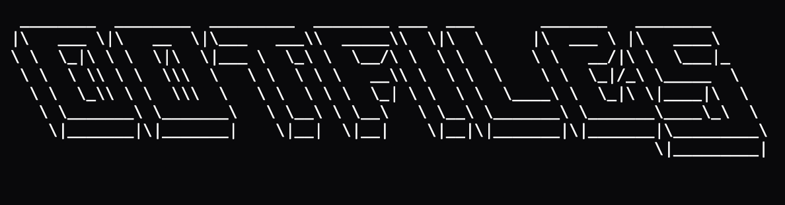
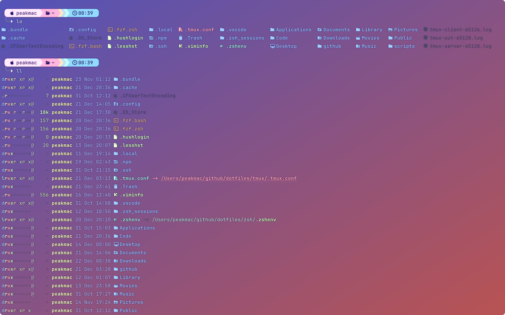
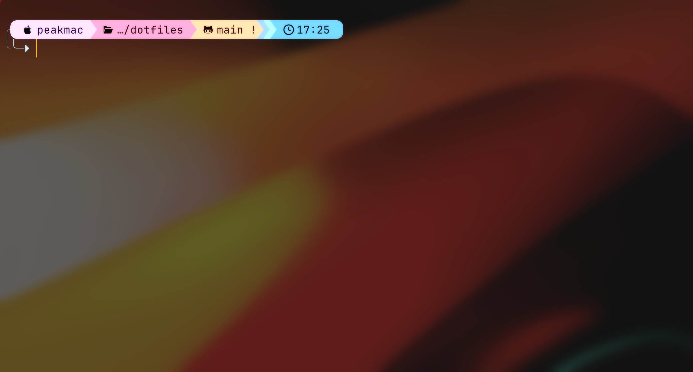
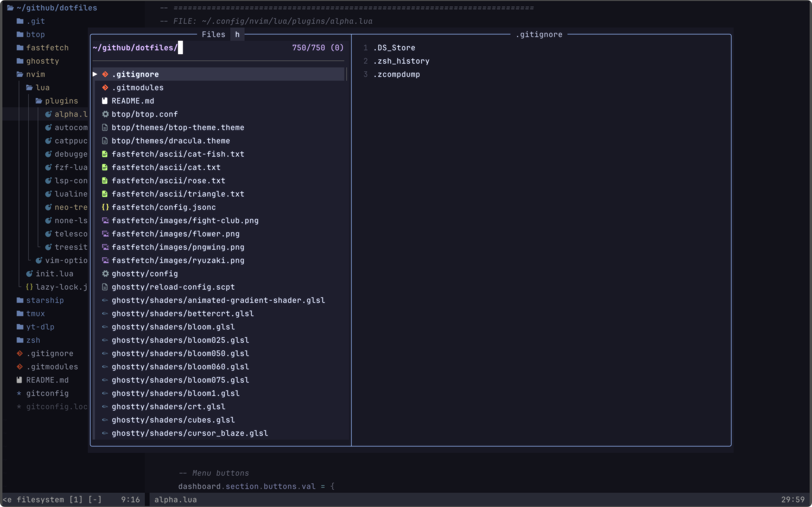
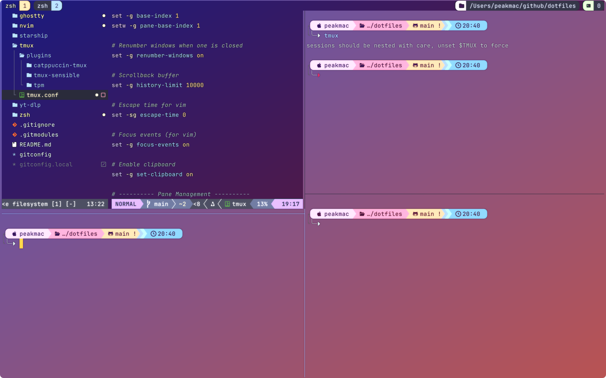

<h1 align="center">
  
</h1>

<p align="center">
  
  
  
  
</p>

**Contents**
---
- [Repo Overview](#repo-overview)
- [How to Apply My Dotfiles](#how-to-apply-my-dotfiles)
- [Zsh](#zsh)
- [Terminal Tools](#terminal-tools)
- [Ghostty](#ghostty)
- [Fastfetch](#fastfetch)
- [Neovim](#neovim)
- [Tmux](#tmux)

**Repo overview**
---
- This repo is where I keep the dotfiles I'm currently using.
- My daily driver OS is macOS and my editor of choice is Neovim.
- I use Ghostty, Starship, and Tmux to customize my terminal workflow.
- I keep updating this repo as I recently got more interested in exploring new tools and setups.

### Directory Structure
```bash
dotfiles/
├── btop
│   └── themes
├── fastfetch
│   ├── ascii
│   └── images
├── ghostty
│   └── shaders
├── nvim
│   └── lua
├── starship
├── tmux
│   └── plugins
├── yt-dlp
└── zsh
    └── plugins
```

**How to apply my dotfiles?**
---
I keep my dotfiles in `~/github/dotfiles/` and have provided symbolic links to `~/.config/`.  

Clone this repository:
   
```bash
mkdir -p ~/.config
git clone https://github.com/69-PEAK/dotfiles.git ~/github/.config/69-PEAK/dotfiles

# or

mkdir -p ~/69-PEAK
git clone https://github.com/69-PEAK/dotfiles.git ~/69-PEAK/dotfiles
```
To learn more about setting up each tool, check the README in each corresponding section of this repository.

 **Zsh Setup**
---
### Install Zsh
brew install zsh

My Zsh configuration files is stored in `~/.config/zsh/.zshenv` which is a symlink to `~/github/dotfiles/zsh/.zshenv`

### Directory Structure
```bash
zsh/
├── .aliases
├── .functions
├── .zsh_history
├── .zshenv
├── .zshrc
├── fzf.zsh
└── plugins
    ├── zsh-autosuggestions
    ├── zsh-completions
    └── zsh-syntax-highlighting
```
## File Overview

- `.aliases` — Custom command shortcuts  
- `.functions` — Custom shell functions  
- `.zshenv` — Environment variables and XDG directories (loaded first)  
- `.zshrc` — Main Zsh configuration: Custom dumping location, options, sources plugins, and prompt  
- `fzf.zsh` — FZF integration  
- `plugins/` — External Zsh plugins

**Plugins:**

zsh-autosuggestions — command suggestions as you type
```bash
git clone https://github.com/zsh-users/zsh-autosuggestions.git plugins/zsh-autosuggestions
```
zsh-completions — additional completions for commands
```bash
git clone https://github.com/zsh-users/zsh-completions.git plugins/zsh-completions
```
zsh-syntax-highlighting — highlights command syntax errors
```bash
git clone https://github.com/zsh-users/zsh-syntax-highlighting.git plugins/zsh-syntax-highlighting
```
> [!IMPORTANT] 
>
> - Do not forget to source each of these plugins in the `.zshrc` file.
> - You can refer to my `.zshrc` to understand how plugin sourcing works.

- For Terminal tools like fzf follow next section.

 **Terminal Tools**
---
### 1. fzf 

`fzf` is an interactive fuzzy finder used for command history search, file navigation, and more.

### Preview :


#### Install fzf
```bash
brew install fzf
```

Run fzf’s install script for default setup and answer **NO** to the prompt that asks to modify shell configuration files

```bash
$(brew --prefix)/opt/fzf/install
```
I have created a dedicated file for fzf configuration: [`fzf.zsh`](zsh/fzf.zsh). 
This file contains all custom keybindings and options related to fzf and is sourced from .zshrc using. 

### 2. eza
`eza` is a modern replacement for `ls` with better defaults, colors, icons, and git integration but I only use it for listing commands.

### Preview :



#### Install eza
```bash
brew install eza
```
I use eza mainly through aliases defined in `~/config/zsh/.aliases`
Custom colors are defined using:
```bash
echo 'export EZA_COLORS="di=1;94:fi=1;32:ln=1;96:ex=1;32:pi=1;33:so=1;35:bd=1;33:cd=1;33:or=1;31:mi=1;31"' >> ~/.zshrc
```
This ensures consistent colors for files, directories, symlinks, and other file type

### 3. vivid

`vivid` is a tool that generates LS_COLORS strings from color themes.  
This allows you to theme your `ls`-style tools and keep colors consistent.

### Preview :


**Install Vivid**
```bash
brew install vivid
echo 'export LS_COLORS="$(vivid generate tokyonight-night)"' >> ~/.zshrc
```

Even though I primarily use `eza`, I keep `LS_COLORS` defined as a fallback for:
- `ls`
- scripts and minimal environments
- Remote servers without eza
- tools that respect GNU LS_COLORS

> [!NOTE] 
>
> You do not need vivid if you primarily use eza, since eza can handle its own coloring.

 **Ghostty Setup**
---
### Preview :



### If Homebrew is not already installed, run the following command in your terminal:
```bash
/bin/bash -c "$(curl -fsSL https://raw.githubusercontent.com/Homebrew/install/HEAD/install.sh)"
```
After installation, make sure Homebrew is in your PATH:
```bash
echo 'eval "$(/opt/homebrew/bin/brew shellenv)"' >> ~/.config/zsh/.zshenv
eval "$(/opt/homebrew/bin/brew shellenv)"
```
You can install Ghostty via Homebrew using this command:
```bash
brew install ghostty
```
I used the [**Spectre Ghostty**](https://spectre-ghostty-config.vercel.app/editor) config editor as a reference and tweaked the commands I liked. I also discovered that you can have a custom Ghostty icon in the macOS Dock. I highly recommend using this editor!
I also added shaders for Ghostty, you can comment out in the config whatever you like during your setup.
- [`ghostty config`](ghostty/config)
> [!NOTE] 
>
> I am currently using the **Catppuccin** theme, so my custom Ghostty theme is commented out in the repository.
> If you want to use one of Ghostty’s built-in themes, run: `ghostty +list-themes`
> If you want to use my custom theme instead, uncomment the # Colors and # Window sections in the Ghostty config file.

```bash
You can tell Ghostty to use a specific config file when launching 'ghostty --config ~/path/to/your/file', though ghostty looks for config '~/.config/ghossty/config' file
```
I use  Starship for the prompt. You can use my Starship config to get the same look, I kept it as simple as possible.
Your .zshrc config just needs to source Starship:
```bash
eval "$(starship init zsh)"
```
- [`starship config`](starship/starship.toml)
> [!NOTE] 
>
> Starship expects its configuration file at `~/.config/starship.toml`

**Fastfetch Setup**
---
### Preview :


### Install fastfetch:
```bash
brew install fastfetch
```

My fastfetch config is stored in `~/.config/fastfetch/conf.jsonc` which contains images, ascii arts and fastfetch config file, again as I already told above, this is a symlink to `~/github/dotfiles/fastfetch/conf.jsonc`.
- [`fastfetch config`](fastfetch/config.jsonc)
> [!IMPORTANT] 
>
> - Fastfetch on macOS doesn't show images until : 
>   - I used `"type": "kitty-direct"` for images, this **does not work for ASCII art**.
>   - If you want ASCII art instead, comment out all `type` entries in the config.

 **Neovim Setup**
---
### Preview :



### Install Neovim:
```bash
brew install neovim
```
My Neovim configuration is stored in `~/.config/nvim/inti.lua`, which is a symlink to `~/github/dotfiles/nvim/init.lua`.

### Directory Structure
```bash
nvim/
├── init.lua
└── lua/
    ├── plugins/
    └── vim-options.lua
```

I am using **LazyVim** as my plugin manager. If you want the same setup as me, I have created README files for key files inside the `nvim/` configuration.  
Please follow the corresponding README for details on each file:

- [`init.lua`](nvim/init.lua/README.md) — main Neovim entry point  
- [`vim-options.lua`](nvim/lua/vim-options/README.md) — custom Vim options and keybindings
- [`plugins/`](nvim/lua/plugins/README.md) — plugin configurations

 **Tmux Setup**
---
### Preview :



### Install Tmux
```bash
brew install tmux
```
My Tmux configuration is stored in `~/.config/tmux/tmux.conf`, which is a symlink to `~/github/dotfiles/tmux/tmux.conf`.
- [`tmux config`](tmux/tmux.conf)
> [!NOTE] 
>
> Tmux expects its configuration file to be named `tmux.conf`
>

---
This dotfiles setup is meant to be a living configuration. I update it as I learn new tools and tweak my workflow. Follow the respective sections above to install, configure, and enjoy a fully-featured terminal environment.
